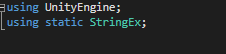
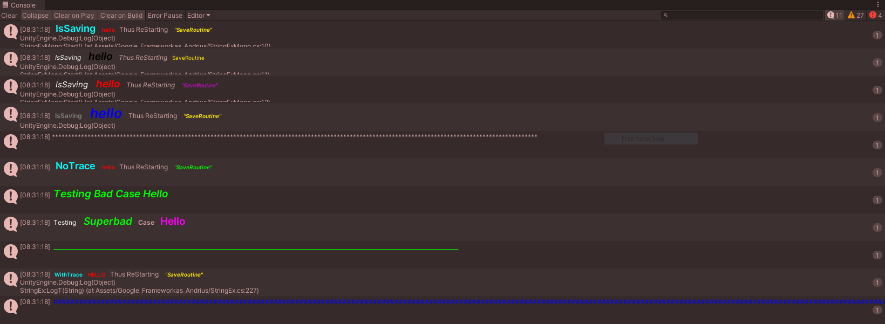

# String Extension And Debug

### Setup

* Copy and Paste [StringEx](/StringEx.cs ) and [StringExMono](/StringExMono.cs ) to unity asset folder (preferable in scripts) and its ready to go

### Use

* Add a `using static StringEx;` So its easy to Apply or Use Log formats
* few example are found in [StringExMono](/StringExMono.cs ) , attach  [StringExMono](/StringExMono.cs ) in empty Gameobject Run editor to see.

**If Using normal Debug.log ** add .Interpolate() at end of interpolated string  i.e $"something".Interpolate()

1. With String interpolated Value

            { Debug.Log($" IsSaving :C:b:18; hello {Apply(Color.red, FontStyle.Bold, value)} Thus ReStarting {Apply("green,bi")}   \"SaveRoutine\"{Apply(Color.yellow, FontStyle.BoldAndItalic, value)}".Interpolate());
}

2. Without String interpolated Value

            { Debug.Log($" IsSaving TiTLeCase :W:I:15:T; hello :R:BI:19; Thus ReStarting :i;  \"SaveRoutine\" :M:10:I;".Interpolate());
}

3. With Log Overload method & String interpolated Value (does not need .Interpolate()) and clean preferable way with extra benefit

            { Log($" NoTrace :C:b:18; hello {Apply(Color.red, FontStyle.Bold, value)} Thus ReStarting {Apply("green,bi")}   \"SaveRoutine\"{Apply(Color.green, FontStyle.BoldAndItalic, value)}");
}
4. Warning example

            { LogWarning($" NoTrace :W:I:15:U; hello :R:BI:19; Thus ReStarting :i;  \"SaveRoutine\" :M:10:I;");
}
5. Create A line

            {  Log(Color.blue, '+', 200); // draws color line of any char  with of defined length
}

* With Log Methods you can turn off LOG and debug with single Bool Key ` StringEx.DoLog = false;` In production for optimization No need to find all debug.log and comment out *** only applies to Log Method
* Log/LogError/LogWarning/LogAssert doesn't do trace (if all you want is to get clean debug) ; LogT/LogErrorT/LogWarningT/LogAssertT does trace that you can logTrace to script

* See more example use in [StringExMono](/StringExMono.cs )

