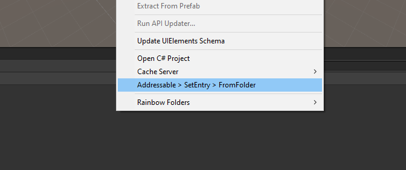
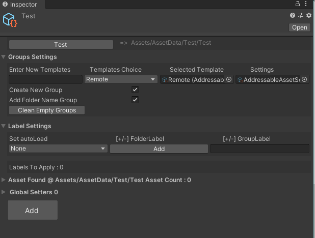

# Set Addressable From Folder
right click in any folder in your project 

This will Create a scriptable object inside the folder , select it and check inspector!

In inspector Set up folder settings

In Label settings ,add on start /onawake / none to do initial Set up , add remove extra labels as need and add FolderLabel 

Before Add 

***

after that click Add button
After Add (depending on label setting this may vary)

***

 Reassign values ( per object in folder you can set values )

***

After Values Reassigned

Check out Two Additional Scriptable object under Asset Data 

***
Now Your Scriptable object can be used in Manager To Auto load Manage for both on start / on Awake , Asset set as not auto load cab be loaded on demand by referencing to folder Scriptable found in every folder that became addressable.

***

[Home](index.md)

[Back](SetUpUnityAddressable.md)

[Set Up Manager](AddressableManager.md)
