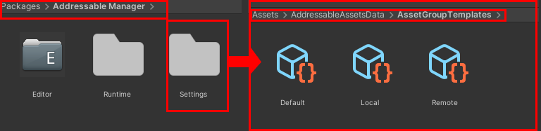

# Set Up Unity Addressable
Install unity Addressable and do initial mandatory Set up.

***

1.  Provided settings inside (package manager /addressable manager /settings) for [remote,default and local ].
2.  if you know what they do and how to create them you can use your own.
3.  alternatively you can enter new settings on field and create new settings,make sure its not named as  [remote,local or default].and set up various config after locating them. 

*** provided remote and local settings are set as packed separately, As i found downloading a huge file is unnecessary, if you want to manage memory. we can only load and unload needed files this way. if you want to pack with other settings you can create new settings and it will appear on drop down list. Addressable group thus created will use that setting, i.e remote/local build or load path etc.. 

[Back](index.md)

[SetAddressablFromFolder](SetAddressablFromFolder.md)

